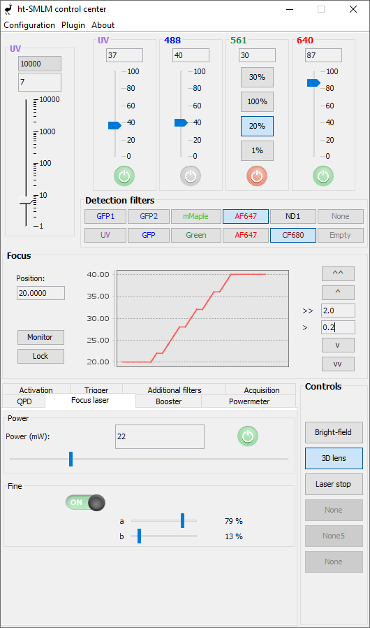

# Overview

htSMLM provides control for a variety of microscope devices, with options to disable unused features and customize the relevant ones.

  

htSMLM is an [EMU]( https://github.com/jdeschamps/EMU ) plugin, and as such, it is configured through the EMU configuration menu. Configuration requires mapping Micro-Manager device properties to GUI properties, in effect assigning a device property change to each button action. Additionally, graphical aspects can be customized. For more information, consult the [EMU guide](https://jdeschamps.github.io/EMU-guide/). In particular, the [quick introduction](https://jdeschamps.github.io/EMU-guide/quickintro.html) gives an easy introduction to the configuration system.

Here is a brief overview of the GUI and what can be parameterized in the configuration:

- Laser pulse/power panel with logarithmic scale, aimed at finely tuning an activation laser for localization microscopy.
  - Text and color of the title
  - Default value for the maximum pulse/power
  - Names of the two laser activation one can choose from
- Control for the power of four independent lasers, with on/off and power percentage.
  - Text and color of the title
  - Enable/disable the On/Off button
  - Slider or buttons
- Filter wheel panel with one or two independent filter wheels.
  - Title of the panel
  - Choose one or two filter wheels
  - Name and color of each filter
- Focus panel, allowing moving a z stage and monitoring its position over time. It also allows locking/unlocking a stabilization maintaining system if it is available in your microscope.
  - Default values for the small and large steps
  - Graph parameters (update frequency, number of points)
- Control panel with on/off buttons
  - Texts displayed on the buttons
  -  Enable/Disable the buttons
- (Optional) Two additional tabs for lasers. These are meant for iBeamtSmart lasers (Toptica) , but the specialized features can be disabled in order to accommodate any general laser.
  - Enable/disable iBeamSmart features individually
- (Optional) A tab with two additional independent filter wheels.
  - Name and color of each filters
  - Name of the filter wheels
- (Optional) A tab with a graph monitoring signals.
  - Monitoring parameters
- (Optional) A trigger tab meant for the laser triggering functions of [MicroFPGA](https://github.com/jdeschamps/MicroFPGA).
  - Name and colors of the lasers
- (Optional) A powermeter tab that can measures a signal, apply a linear transformation to mW and plot the signal.
  - Linear transformation parameters
  - Wavelengths (for display purposes)
  - Monitoring parameters
- An activation tab to perform activation in localization microscopy
- An automated acquisition tool compatible with localization microscopy
