# Using htSMLM

1. [General tips](#general-tips)
2. [Default panels](#default-panels)
3. [Optional panels](#optional-panels)
4. [Activation script](#activation-script)
5. [Acquisitions with htSMLM](#acquisitions-with-htsmlm)

------

## General tips

- To validate what one enters in a text field, either press **enter** or click away from the field.
- All monitoring threads can be turned on/off. During imaging, and depending on your workstation, the updating of graphical components in Java and Micro-Manager can be stalling. This includes the refreshment of the acquisition window. In order to lift the number of actions the main graphical thread has to perform, turn off the various htSMLM monitoring (except the activation or acquisition if your are using them). 

------

## Default panels

#### Activation laser panel

  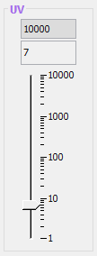

The activation laser panel offers a logarithmic scale with a user-defined maximum value. It corresponds to a single GUI property: **UV pulse duration (main frame)**. While it is intended for a pulse duration in us, it can be used with an absolute laser power or power percentage, albeit with reduced dynamical range.

- Slider: change the laser pulse / power up to the maximum value.
- Top text field (gray background): change the maximum value allowed for the laser pulse / power. The value must be an integer.
- Bottom text field: change the laser pulse / power up to the maximum value. Decimals are accepted.

The laser name and colors are the same as the first laser (Laser 0, see parameters).

#### Laser control panel

  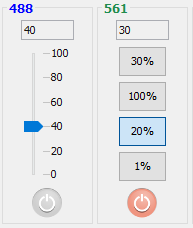

htSMLM has four main laser control panels. Each laser control panel interacts with two GUI properties: **Laser # power percentage** and "**Laser # enable**" (where # is 0, 1, 2 or 3). Additionally, two modes of power percentage control are available: slider or buttons.

- On/Off button: switches the "**Laser # enable**" property between its ON and OFF state.
- Power percentage: change the "**Laser # power percentage**" value.
  - Slider mode:
    - Slider: changes the GUI property to the set value and display the new value in the text field.
    - Text field: changes the GUI property to the set value and updates the slider. The text field only accepts integer values.
  - Buttons mode:
    - 1%, 20% and 100% buttons:  set the GUI property to the corresponding power percentage.
    - User-defined percentage button: selecting the button sets the GUI property to the displayed percentage.
    - Text field: choose the user-defined percentage. Note that by changing the user-defined percentage, the GUI property is only change if the button is currently selected.

The laser name and the colors are GUI parameters. Additionally, Laser 0 name and color are linked to the activation laser panel.

Note that the laser percentage GUI property can be mapped to an absolute laser power, as long as the slope parameter (properties tab in the EMU configuration wizard) rescales the power to the range 0-100.

#### Filters panel

  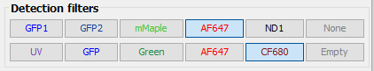

The filter panel offer controls for one or two filter wheels. Only one filter can be selected in each row, setting the GUI property "**Filter wheel position**" (or **Filter wheel 2 position**) to the corresponding state.

All texts and colors, as well as the panel title, can be set in the properties tab of the EMU configuration wizard.

#### Focus panel

  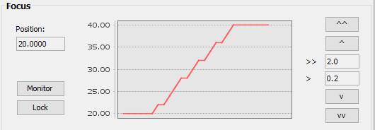

The focus panel allows moving and monitoring the position of your focusing device ("**Z stage position**" GUI property). It also includes a button to enable or disable focus stabilization, if this feature is present on your microscope (see examples such as [pgFocus](https://github.com/ries-lab/RiesPieces/tree/master/Microscopy/Focus-locking) or the [Ries lab solution]( https://github.com/ries-lab/RiesPieces/tree/master/Microscopy/Focus-locking )).

- Position: set the GUI property to the requested value (up to two decimals). 
- Monitor: toggle the monitoring of the focus position, updating the graph.
- Lock: switch the "**Z stage focus-locking**" GUI property between it's ON and OFF states.
- "^^" and "vv": move the stage up or down by the value indicated in the ">>" text field.
- "^", "v" and ">":  move the stage up or down by the value indicated in the ">" text field.

Two parameters can be set: the number of points shown in the graph and the graph update frequency. Finally, the large and small steps default values are parameters.

#### Controls panel

  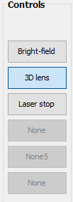

The controls panel contain a few toggle buttons that can be used to switch certain devices between two states. This can for instance be in/out elements (lenses, single filters, laser stops) or on/off (bright-field light). Each button corresponds to a "**Two-state device #**" GUI property, and their text can be customized. Finally, unused buttons can be disabled in the parameters. 

------

## Optional panels

#### Additional filters panel

  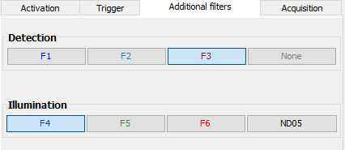

The additional filters panel contains two filter wheels / sliders with four positions each. The two filter wheels GUI properties are called **Slider # position**.

All titles, including the tab title, names and filter colors can be set in the parameters.

#### QPD tab

  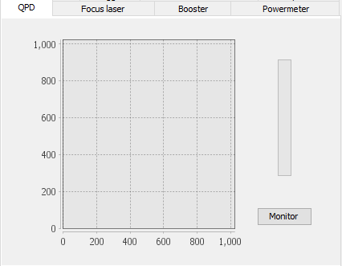

The QPD tab was designed to monitor a quadrant photodiode used in a [home-made focus stabilization system](https://github.com/ries-lab/RiesPieces/tree/master/Microscopy/Focus-locking). It has three GUI properties: X, Y and Z (**QPD #**). When the monitor button is selected, the panel continuously updates with the values of the device properties mapped to X, Y and Z. The graph plots Y vs X, while the progress bar shows the value of Z as a percentage of filling. 

The maximum values for X and Y (same for both), and for Z can be set in the parameters, as well as the time in between two updates.

In case Micro-Manager has trouble with refreshing an image display during acquisition, deselect the monitoring button.

#### Laser trigger tab

  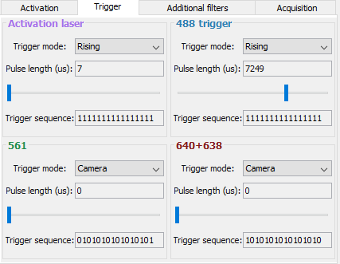

The laser trigger tab was meant to be used with [MicroFPGA](https://github.com/jdeschamps/MicroFPGA), an electronic platform that allows flexible laser triggering, among other things. Refer to MicroFPGA to understand the different triggering parameters and how to set-up the system. 

Since this panel is specific for the MicroFPGA project, the device properties are named similarly as the GUI properties: the device property "Mode0" should be mapped to one of the **Laser # trigger mode** GUI properties, and likewise for pulse duration and sequence.

Here is a short summary of the panel's function:

-  Trigger modes:
  - On: on all the time
  - Off: off all the time
  - Rising: pulse on rising edges of the camera trigger
  - Falling: pulse on falling edges of the camera trigger
  - Camera: the trigger follows the camera trigger
- Pulse length: integer pulse length in us of the laser in rising/falling modes. Both slider and text field change the pulse length.
- Trigger sequence: pattern of on/off (at each camera frame) consisting of 16 digits (0 or 1)

The trigger sequence turns red if a digit other than 0 or 1 is entered. It turns blue if there are too many or too few digits.

**Note**: The slider of the first laser ("activation laser" in the example) is linked to the slider in the activation laser panel (see the default panels section).

#### Powermeter tab

  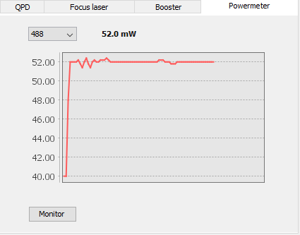

The powermeter tab, as its name gives it away, plots currently measured laser power. The laser power is read through a single GUI property: **Laser powermeter**. The Ries lab uses a simple custom [powermeter](https://github.com/ries-lab/RiesPieces/tree/master/Electronics/Powermeter).

Select the "monitor" button to start plotting the laser power. Each update round, the script performs a simple scaling of the device property value and adds it to the plot.

In the parameters, you must enter the slopes and offsets used for the scaling of each wavelength. The wavelengths must also be provided in the parameters tab of the configuration menu. All slopes, offsets and wavelengths are provided as comma-separated values.

Finally, the  number of points and the time between two updates can also be set in the parameters tab.

#### iBeamSmart laser tab

  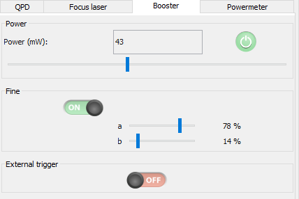

The iBeamSmart laser tab is also a specialized panel, tailored to Toptica iBeamSmart series. Nevertheless, it is designed so that iBeamSmart specific features can be removed from the GUI by unselecting the corresponding parameters (**[Name] - external trigger available** and **[Name] - fine available**, where Name is the name given to the lasers in the Settings tab).

- Power:

  - The slider and the text field are linked an modify the same GUI property (**[Name] laser power**). The maximum power can be set in the parameters. Set it to 100 if your laser only has a laser power percentage device property.
  - The on/off button switches **[Name] operation** between its on and off states. 
- (Optional) Fine:

  - This sub-panel can be hidden by unselecting  **[Name] - fine available** in the parameters.
  - If you have an iBeamSmart laser, then the device property and GUI property names are similar (**[Name] enable fine**, **[Name] fine a (%)** and **[Name] fine b (%)**).
  - The fine can be turned on/off using the toggle button, while the fine a and b percentage are set by the sliders.
- (Optional) External trigger:

  - This sub-panel can be hidden by unselecting  **[Name] - external trigger available** in the parameters.
  - The external trigger can be toggled between on and off using the toggle button.

------

## Activation script

htSMLM provides an activation script that can be used to increase the activation laser power throughout a localization microscopy experiment. The activation script is also controlled by the automated acquisitions scripts.

  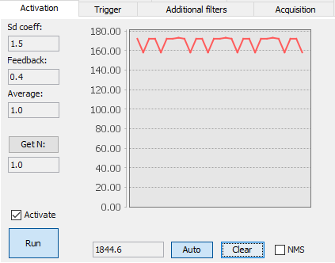

The activation script estimates the number of molecules at a time, compare it to a user-defined target number and increase/decrease the activation laser pulse duration (**UV pulse duration (activation)**) to bring the estimated number of molecules closer to the target number. 

### GUI

Here are the GUI functionalities:

- **Sd coeff**: determines the cut-off used to estimate the number of molecules. For the same images, a higher Sd coeff yields a higher cut-off and thus a lower estimated number of molecules.
- **Feedback**: control the speed of the pulse length increase or decrease. A higher value causes the pulse duration to change more rapidly (technically, the steps are bigger in between each update). 
- **Average**: length of the rolling window average of the cut-off. A higher value yields a more stable cut-off, and thus smoother changes of pulse duration.
- **Get N**: by clicking on the button, the N text field is updated with the most recent estimated number of molecules.
- **N text field**: target number of molecules.
- **Activate**: when the checkbox is selected, the pulse duration is updated. If the checkbox is not selected, then the script can run without updating the pulse duration. This allows setting the parameters without causing uncontrolled changes of the pulse duration.
- **Run**: start/stop the activation script.
- **Cut-off field**: users can enter here a cut-off value. If **auto** is selected, the cut-off field is updated with the automatically calculated cut-off. We recommend always using this option.
- **Auto**: select to automatically calculate the cut-off at every cycle.
- **Clear**: clears the graph.
- **NMS**: when selecting the checkbox, a window is open showing the result of the molecule number estimation algorithm. This can be used to choose the right Sd coefficient.

The number of points shown in the graph, as well as the time between two updates can be set in the parameters tab of the configuration.

### Algorithm

1. If the camera is currently live, the algorithm estimates the number of molecules that are activated:
   1. Two images are extracted from the Micro-Manager circular buffer. Since the circular buffer is emptied rapidly, the images are probably not consecutive.
   2. The two images are converted to ImageJ ImagePlus and then subtracted from each other, giving *Is*.
   3. The resulting imaged is Gaussian blurred (*Ig*) with the following parameters: X,Y standard deviations of **3** pixels and kernel accuracy of **0.02**. See [blurGaussian](https://github.com/imagej/imagej1/blob/master/ij/plugin/filter/GaussianBlur.java) for the specific implementation.
   4. A temporary cutoff is estimated as: *tcutoff* = mean(*Ig*) + **Sd** x std(*Ig*), where **Sd** is defined in the GUI.
   5. If **auto cutoff** is selected (see GUI), the cutoff is set to *c*(t) = (1-1/**dT**) x *c(t-1)* + *tcutoff* / **dT**, where **dT** and the **auto cutoff** are set in the GUI, and *c(t)* is the cutoff at time *t*.
      If the **auto cutoff** is not selected, then *c*(t) = *tcutoff*.
   6. Finally, the *c(t)* and *Is* are passed to a non-maximum suppression (NMS) algorithm. See [Neubeck, A., & Van Gool, L., IEEE. (2006)](https://ieeexplore.ieee.org/abstract/document/1699659) for reference implementation. The NMS algorithm returns the number of estimated molecules, *N*.
2. Then, the updated pulse duration of the activation laser is computed:
   1. The current pulse, *p(t)*, is retrieved.
   2. A delta pulse, stored in memory, is updated: *dp(t)* = 0.1+ *dp(t-1)* + **Fd** x *p(t)* x (1-*N*/**N0**), where *N* was estimated in the previous steps and **Fd** (feedback) and **N0** (under "get N") are set by the user in the GUI.
   3. The new pulse is calculated as *p(t+1)* = *p(t)* + *dp(t)*
   4. If |*dp(t)*|>1, then *dp(t)* is set to 0. This insures that *dp* remains small, while also allowing not to be stuck for too long with pulses < 1.
   5. If *p(t+1)* is 0 and *dp(t)* is negative, then *dp(t)* is set to 0. This prevents the algorithm to start increasing the pulse as soon as the number of molecules *N* becomes smaller than **N0**.
   6. If the new pulse is larger than the **maximum pulse** (set in the GUI, in the activation laser pulse panel), then *p(t+1)* = **maximum pulse**.
3. Finally, the activation laser pulse length is updated.

Note that the activation script has been written for 16 bits depth cameras, and will not work for 8 bits one. This would be quite simple to fix, if this is your case, please open an issue on Github.

------

## Acquisitions with htSMLM

The native Micro-Manager acquisition tool (MDA plugin) acquires the different dimensions (position, time, z) in a multiplexed manner and not one after the other (e.g.: for each position, first time, then z-stack). Furthermore, localization microscopy requires in most cases an activation laser to ramp up over time. Being able to further acquire a z-stack (GFP channel for instance) or take snapshots with different channels (Betrand lens to check the back-focal plane or brightfield illumination) increases the information available for post-analysis.

Therefore, htSMLM uses Micro-Manager acquisition engine to perform complex experiments allowing sequential acquisitions, including localization microscopy. Through the acquisition wizard, users design a set of acquisitions, each with the possibility to choose the state of the microscope (each device property linked to the interface). Using the stage position list from Micro-Manager, they can also choose a number of positions on which to run the acquisitions. Finally, after starting the script, each acquisition is run one after the other on each position. The acquisition lists is automatically saved and can be reused later on.

Note that the acquisitions are intended to work with a [focus stabilization system](https://github.com/ries-lab/RiesPieces/tree/master/Microscopy/Focus-locking) and a [pulsed activation laser](https://github.com/jdeschamps/MicroFPGA). The acquisitions can be run without these features but will not be used to their full potential. 

### Acquisition tab

  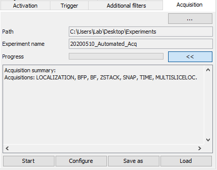

The acquisition tool can be found in the Acquisition tab:

- **"..." button**: opens a folder chooser dialog in order to select in which folder should the experiments be saved. If a folder is chosen, its path appears in **Path**.
- **Path**: parent folder where the experiments will be saved.
- **Experiment name**: prefix used to name each experiment folder.
- **Progress**: indicates the progress of the experiments.
- **"<<" or ">>"**: shows/hides the experiments summary:

  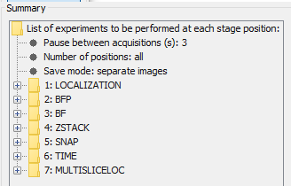

- **Start**: starts/stops the acquisition.
- **Configure**: starts the Acquisition wizard (see next section).
- **Save as**: saves the acquisitions list in the folder of the user's choice.
- **Load**: loads an acquisition list.

### Acquisition wizard

The acquisition wizard is started from the Acquisition tab and allows designing a complex set of experiments.

  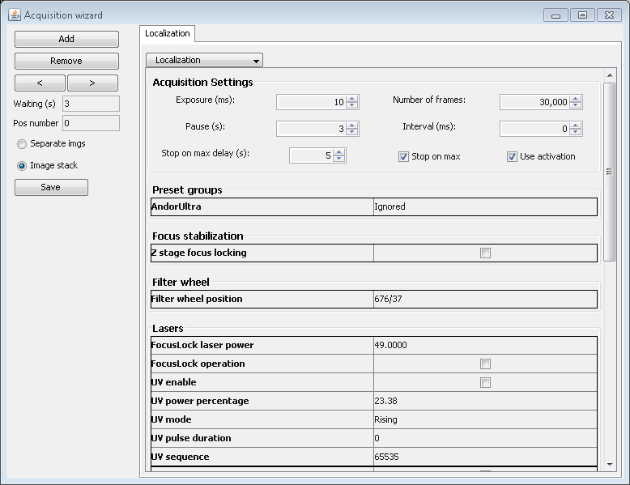

 The GUI consists of three main areas:

- **Left panel**: general parameters and creation/destruction of acquisitions.
- Acquisition tabs:
  - **Acquisition Settings**: acquisition specific parameters.
  - **Microscope state**: list of configuration preset groups (defined in the main Micro-Manager window) and device properties mapped to htSMLM.

##### Left panel

The left panel has the following components:

- **Add**: adds an acquisition tab to the end of the list.
- **Remove**: removes the currently selected tab.
- **"<" or ">"**: moves left or right the currently selected tab.
- **Waiting (s)**: waiting time (in seconds) before starting the experiment, the waiting time only occurs once after moving to a new position.
- **Pos number**:  number of positions to use from the position list. It uses only the n first position. If n=0, it uses all positions.
- **Separate imgs or Image stack**: saves the acquisitions as separate images or as Micro-Manager image stacks.
- **Save**: saves the current acquisition lists and closes the window. After saving, the Acquisition tab in the main htSMLM window is updated with the acquisition list.

##### Acquisition settings

The acquisition settings is an acquisition specific panel. By changing the acquisition type using the drop down list at the top of the acquisition tab, one can change the acquisition settings.

All acquisition settings are described in the Acquisition types section.

##### Microscope state

The microscope state is a list, arranged by type, of the different device properties known to htSMLM. They usually are named as in the EMU configuration wizard, to the exception of some GUI properties that bear their friendly names (e.g. lasers).

For each acquisition, the microscope state is applied before acquiring. 

The following sections are available:

- **Preset groups**: these are the configuration preset groups defined in the main Micro-Manager window. They can be set to **Ignored**, which will cause them to not be modified by the acquisition. Note that if an acquisition modifies a preset group, but the others ignore it, then it will remain in the modified state throughout the other acquisitions.

- **Focus stabilization**: this section is only available if a focus stabilization has been declared (in the parameters tab of the EMU configuration). It allows deciding whether the focus should be stabilized or not during the acquisition. For certain types of acquisition this section is not available because other options decide on the focus stabilization state.

- **Filter wheel**: choose the filter wheels state.

- **Lasers**: all laser related GUI properties that have been mapped to a device property.

- **Two-state**: all two-state (on/off) GUI properties that have been set.

  

#### Acquisition types

Each acquisition type has specific parameters.

##### Localization

  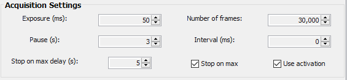

- **Exposure (ms)**: camera exposure.
- **Number of frames**: number of frames to acquire.
- **Pause (s)**: pause before starting the acquisition.
- **Interval (ms)**: interval between frames.
- **Stop on max delay (s)**: delay in seconds after which to stop the acquisition once the maximum pulse duration value (defined in the activation laser panel) is reached. This value has no effect if "stop on max" or "use activation" are not selected.
- **Stop on max**: stop when the maximum pulse duration value (defined in the activation laser panel) is reached.
- **Use activation**: use the activation script with the parameters set in the GUI (activation tab) if the checkbox is selected.

A localization experiment resembles a time experiment, albeit with the activation script running in the background and capable of stopping the acquisition if the maximum activation pulse is reached. Note that the activation parameters are set directly in the activation panel.

##### BFP or Bright-field or Snap

All BPF, Bright-field and Snap acquisitions are similar. BFP or Bright-field acquisitions are only available if they have been declared in the Parameters tab of the EMU configuration. Then, both BFP or Bright-field acquisitions turn on their respective GUI property before the acquisition and switch it off after the acquisition.

  

- **Exposure (ms)**: camera exposure.

- **Pause (s)**: pause before starting the acquisition.

  

##### Z-stack

  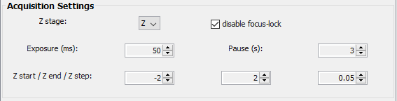

- **Z stage**: select which z-stage to use to perform the z-stack.
- **Disable focus-lock**: if a focus stabilization system is present, selecting the checkbox causes the focus-lock to be off during the z-stack. It is turned back on again at the end of the acquisition. 
- **Exposure (ms)**: camera exposure.
- **Pause (s)**: pause before starting the acquisition.
- **Z start**: z position (um) at which to start the stack.
- **Z end**: z position (um) at which to end the stack.
- **Z step**: step (um) between each slice.

##### Time

  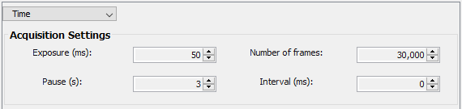

- **Exposure (ms)**: camera exposure.
- **Number of frames**: number of frames to acquire.
- **Pause (s)**: pause before starting the acquisition.
- **Interval (ms)**: interval between frames.

##### Multislice localization

This acquisition type is quite complex, in particular due to the activation and focus stabilization options. 

The main principle of this acquisition is to perform localization microscopy at different heights, and loop several time through the slices. For instance by choosing **N loops / N slices / dZ (um)** = (2,3,0.3), then the acquisition will process as follow:

1st loop: 

1. image slice 0 at Z0
2. image slice 1 at Z0+0.3
3. image slice 2 at Z0+0.6

2nd loop: 

1. image slice 0 at Z0
2. image slice 1 at Z0+0.3
3. image slice 2 at Z0+0.6

See the definition of each parameter below, plus some more details on the activation and focus stabilization.

  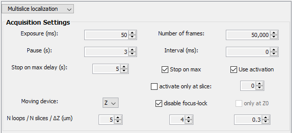

- **Exposure (ms)**: camera exposure.
- **Number of frames**: number of frames to acquire per slice and per loop.
- **Pause (s)**: pause before starting the acquisition.
- **Interval (ms)**: interval between frames.
- **Stop on max delay (s)**: delay in seconds after which to stop the acquisition once the maximum pulse duration value (defined in the activation laser panel) is reached. This value has no effect if "stop on max" or "use activation" are not selected. Note that the delay only works within the same slice.
- **Stop on max**: stop when the maximum pulse duration value (defined in the activation laser panel) is reached.
- **Use activation**: use the activation script with the parameters set in the GUI (activation tab) if the checkbox is selected.
- **Activate only at slice**: only use activation at a pre-determined slice (see next bullet point).
- **Slice Zs**: slice at which to activate (counting is 0 based).
- **Moving device**: z-stage used to move the focus.
- **Disable focus-lock**: if checked, the focus stabilization is disabled throughout the entire acquisition. If unchecked, then the focus stabilization is maintained. This means that in such case, the moving device must be chosen to be the stage carrying the sensor used in the feedback loop to the objective stage. For more details, see QPD in the [Ries lab focus stabilization system](https://github.com/ries-lab/RiesPieces/tree/master/Microscopy/Focus-locking). Selecting the sensor stage and keeping the focus-lock active means that the experiment can be performed by moving the sensor stage only.
- **Only at Z0**: if checked, the focus stabilization is only enabled at Z0 (the starting Z) and not while imaging the other slices. This allows readjusting the Z range every time the acquisition moves to the Z0 slice. If unchecked, the focus stabilization is kept throughout the slices.
- **N loops**: number of loops through the slices.
- **N slices**: number of slices to image during a single loop.
- **dZ (um)**: z step (um) between each slice. Note that the z step refers to movements of the z-stage selected above.

**Activation**: 

Only working if there is a device property mapped to the **UV pulse duration (activation)** GUI property.

| Use activation | Stop on max | Only at slice |                            Result                            |
| :------------: | :---------: | :-----------: | :----------------------------------------------------------: |
| <li>- [x]</li> |    - [x]    |     - [x]     | Activate only at slice St and will stop the  entire acquisition when reaching the maximum pulse |
|     - [x]      |    - [x]    |    - [  ]     | Activate at every slice and will stop the entire  acquisition when reaching the maximum pulse |
|     - [x]      |   - [  ]    |     - [x]     | Activate only at slice St and will not stop the acquisition when reaching the maximum pulse |
|     - [x]      |   - [  ]    |    - [  ]     | Activate at every slice and will not stop the acquisition when reaching the maximum pulse |
|     - [  ]     |   - [  ]    |    - [  ]     |                        No activation                         |

**Focus-stabilization**:

Only working if there is a device property mapped to the **Z stage focus-locking** GUI property and if the z stabilization parameter is set to this GUI property. Here "acquisition" refers to the entire MultiSliceLocalization acquisition (all loops/slices included).

| disable focus-lock | only at Z0 |                            Result                            |
| :----------------: | :--------: | :----------------------------------------------------------: |
|       - [x]        |   - [  ]   | No FS during the acquisition. The FS is disabled  at the start of the experiment and switched on at the end. |
|       - [  ]       |   - [x]    | FS only at Z0 during the experiment, switched off for all other slices. Switched on at the end of the acquisition. |
|       - [  ]       |   - [  ]   | FS switched on all the time. Use only if your FS sensor is mounted on a stage and that you can use this stage to perform a z-stack by selecting it as **Moving device** |

FS: focus stabilization.

#### Acquisition script

This section describes the acquisition process:

1. Saves the acquisition lists in the same folder where the raw data will be saved.
2. Start the experiment:
   1. Retrieves position list
   2. For each position (up to the maximum position):
      1. Move to position
      2. Wait for the number of seconds defined in **Waiting time (s)**.
      3. For each acquisition:
         1. Set-up the microscope state
         2. Set the preset group settings
         3. Set exposure
         4. Wait for the number of seconds defined in "**Pause (s)**"
         5. Perform acquisition (see individual acquisition processes in the next section)

Each acquisition type might proceed differently, here we describe only the more complex or exotic acquisition types (see previous point 5 in acquisition):

- **Localization**:
  
  1. If **use activation**, reinitialize the activation (pulse = 0) and activation running.
  2. Start time acquisition.
  3. In parallel, if **use activation** and **stop on max**:
     1. Check if pulse has reached maximum
     2. If yes, stop acquisition after **stop on max delay** seconds
     3. if not, wait 1 s and check again.
  4. After the experiment stopped (enough frames acquired or stopped on max), pause the activation task and reinitialize it.
  
- **Multislice localization**:
  
  This one is complex and still experimental.
  
  1. if the **focus stabilization is disabled** or it **is enabled** but **only at Z0**, turn off the focus stabilization. If the **focus stabilization is enabled for all slices**, then turn it on.
  2. if **use activation**, reinitialize the activation and pause it.
  3. Save Z0 position (starting position).
  4. For each loop:
     1. For each slice:
        1. if **use activation**, and either it **only activates at slice Zs**  and **this is the current slice** or it **always activates**, then (re)start activation.
        2. Set new position: z = Z0 + **dZ** * slice_number
        3. if **the focus stabilization is not disabled** but it is **only enabled at Z0** and **this is Z0**, then switch on the focus stabilization. 
        4. Start the acquisition of N n**umber of frames** at this slice.
        5. While the acquisition is running, if we **use the activation** and the **acquisition should be stopped on max activation**, and either **we activate only at Zs** and **this is Zs**, or we **always activate**, then stop the acquisition after the **stop on max delay** if the activation pulse reached its maximum.
        6. After the slice acquisition, if the focus stabilization is enabled but **only at Z0** and this is **Z0**, then update the Z0 position in memory, then switch off the focus stabilization.
        7. if **use activation**, and either it **only activates at slice Zs**  and **this is the current slice** or it **always activates**, then pause activation.
  5. At the end, switches on the focus stabilization if it was off.
  6. Reinitialize the activation.
  
- **BFP acquisition**:

  - Turn on the BFP property
  - Acquire a snapshot
  - Turn off the BFP property

- **Bright-field acquisition**:

  - Turn on the bright-field property
  - Acquire a snapshot
  - Turn off the bright-field property
